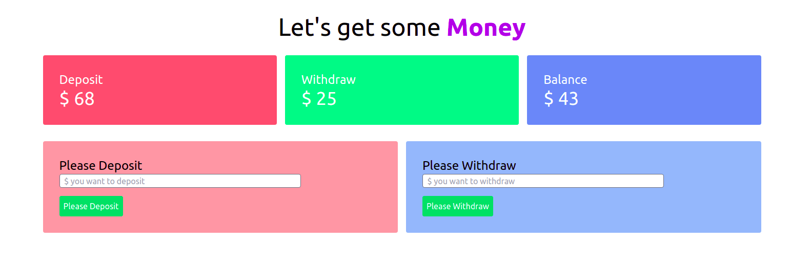

# Title-Info
> This project is about a simple banking system where we can deposit, withdraw and see the recent status of money.

# ScreenShots

## Built With
- HTML
- Javascript
- VScode
- Tailwind
- Webpack

## Live Demo
For the link to the live demo, [Click here](https://tufahel.github.io/baper-bank/)

## Getting Started
To get a local copy up and running you just need to follow the following steps;
- Clone this repository with
git clone https://github.com/Tufahel/baper-bank.git using your terminal or command line.
- run code `.` to open it in vscode
- run `npm install` in terminal
- run `npm run build` in terminal
- run `npm start` and, now you are ready to use this web app.

## Author

👤 **Tufahel**

- GitHub: [@Tufahel](https://github.com/Tufahel)
- Twitter: [@Tufahel](https://twitter.com/TufahelAhmed)
- LinkedIn: [Tufahel Ahmed](https://www.linkedin.com/in/tufahel-ahmed/)

## 🤝 Contributing

Contributions, issues, and feature requests are welcome!

Feel free to check the [issues page](../../issues/).

## Show your support

Give a ⭐️ if you like this project!

## Acknowledgments

- Programming Hero Team

## 📝 License

This project is [MIT](./MIT.md) licensed.
